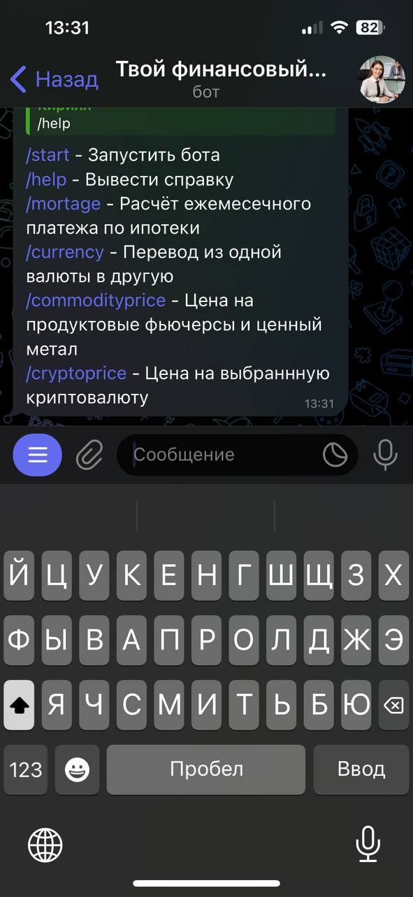
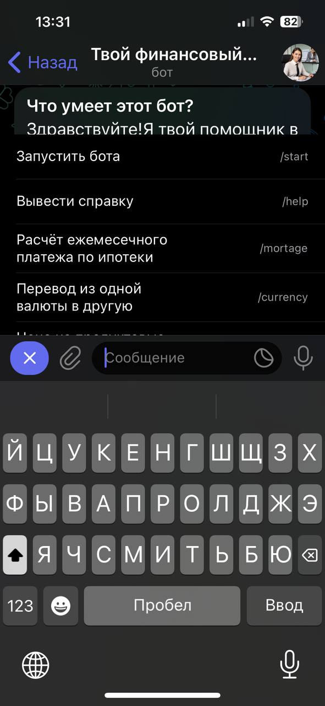
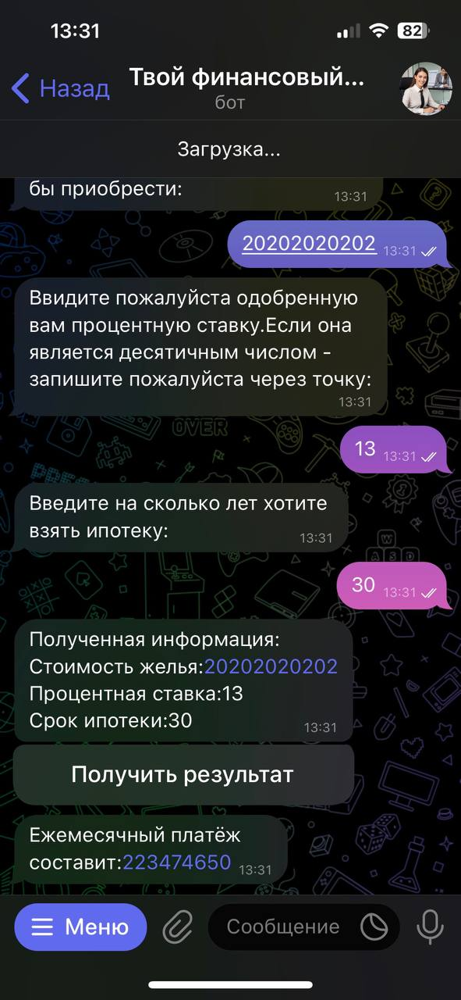
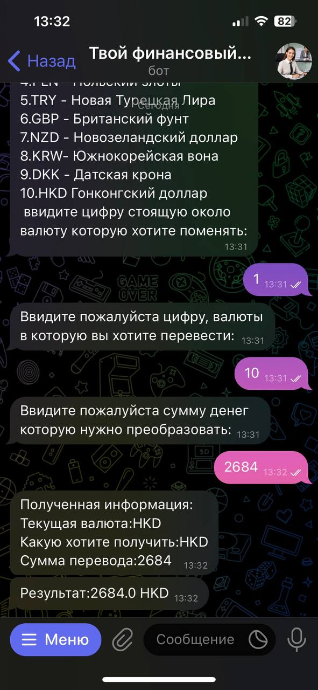

### Название проекта
Финансовый бот 

### Описание
Если вы хотите получить быстро информацию по этим 4 экономическим параметрам:
-Подсчёт ежемесячного платежа по ипотеке
-Перевод из одной валюты в другую
-Вывод стоимости ваучеров на товары и ценные металлы 
-Вывод цен криптовалют 
То мой бот вам с этим может помочь! Он сделает за вас поиск информации по данным запросам и выдаст всю необходимую информацию за 5 секунд
Одно нажатие пальцем равно 1 часу поиска информации самостоятельно, и всё это в одном месте и бесплатно.
### Визуальные материа  
Справка по команде /help

Cправка по кнопке меню справа:

Подсчёт ипотеки:

Перевод из одной валюты в другую:

### Технологии
Применяемые библиотеки:
import os
import requests
import json
from telebot.types import Message
from telebot import TeleBot
### Функции
Основные функции и возможности проекта. Что делает ваш проект уникальным?
Функционал проекта состоит в выполнение 4 важных функций:
-Подсчёт ежемесячного платежа по ипотеке
-Перевод из одной валюты в другую
-Вывод стоимости ваучеров на товары и ценные металлы 
-Вывод цен криптовалют 
Уникальность проекта состоит в том, что в одном месте собраны экономическе возможности многих сайтов, если вам одновременно хочется узнать 
ежемесячный платёж по ипотеке и вы хотите уехать в другую страну,но не занаете куда?
Вы можете узнать свой ежемесячный платёж по ипотеке, а затем оставшиеся переводить в представленнуые валюты и где будет больше местных денег
можете спокойно туда отправляться и не думая, что потратите все деньги и не останется на ипотеку
Или не знаете куда вложиться в криптовалюту или ценные металлы, можете посмотреть цены в моём чатботе и сделать выводы
### Начало работы
Вам необходимо взять бот токен для запуска проекта и чтобы доступ был только у вас, а затем взять api-key с сайта, c которого я беру всю пнформацию для 
работы
### Как внести вклад
Свой вклад можно внести добавлением новых функций в чат бот, который ему помогут стать более экономически насыщенным, так же подключение к другим сайтам, 
с которых он может брать информкцию для работы

### Лицензия

### Статус проекта
Статус проекта: не активен

### Контакты
Почта - kad18vg1@mail.ru

### Благодарности
Хотелось бы выразить благодарно кураторы Станиславу Никуличеву, за его помощь и наставничество во время выполнения